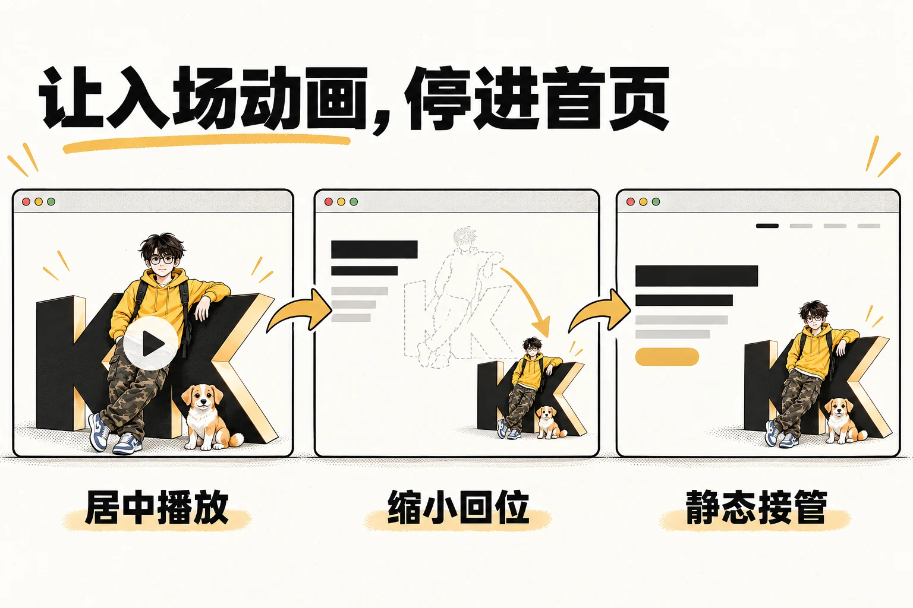

# kk-hero-handoff

让入场视频自然回到网页，接上静态首屏。这个 Agent Skill 面向已有网站，负责素材准备、居中播放、缩小回位、文字出现与静态画面衔接。



## 演示

https://github.com/user-attachments/assets/3455839e-b984-476d-8c80-55e6e5852136

约 8 秒实际网页录屏。上方插画解释原理，回位位置由你的网站布局决定。

## 开始使用

把这句话发给 Agent：

```text
请从 https://github.com/kkfor30/kk-hero-handoff 安装 kk-hero-handoff，
遵循本机技能目录约定，并检查运行依赖。
```

打开网站项目，提供静态场景原图和已有视频（如果有），再说：

```text
使用 $kk-hero-handoff，帮我的网站增加入场动画。
先检查首屏和素材，让视频居中播放后回到主视觉位置，
文字同步出现，最后接上静态首屏。保留当前布局和文案。
```

需要 **Python 3.11+、FFmpeg / FFprobe**，Python 脚本无第三方依赖。浏览器模板使用 ES modules，无前端框架依赖。

<details>
<summary>手动安装</summary>

下载仓库 ZIP，将完整文件夹命名为 `kk-hero-handoff`，按宿主约定放入技能目录，重新打开会话。脚本、参考文档和模板需一起保留。已配置共享技能库时使用本机管理入口。

其他支持本地 `SKILL.md` 的 Agent 可按其安装方式使用，兼容性未逐一验证。

</details>

## 能帮你做什么

| 当前情况 | 处理方式 |
| --- | --- |
| 有静态页面，没有视频 | 整理首尾帧要求和视频提示词，供你在生成平台制作 |
| 已有视频 | 检查尾部画面，选定接管帧，完成网页衔接 |
| 动画衔接不自然 | 排查位置、时序、底图版本、色差与边缘 |
| 加载失败或减少动态效果 | 回到静态页面；支持跳过、重播、session 内只播一次 |

视频负责场景动作，网页负责位置和文字时序，因此调整回位位置不必重新生成视频。接管记录绑定视频版本，替换素材后可重新核对。

**不内置视频生成 API**，使用所选工具生成视频后，将文件路径交给 Agent 继续处理。图片生成取决于当前 Agent 的可用工具。

## 手动接入

在 Skill 根目录运行，路径替换为实际素材位置：

```sh
python -X utf8 scripts/probe_intro.py hero-rest.png intro.mp4
python -X utf8 scripts/extract_tail.py intro.mp4 handoff.png
python -X utf8 scripts/validate_handoff.py --static hero-rest.png --video intro.mp4 --report handoff.json
```

抽帧默认取最后一个实际视频帧，也可用 `--frame` 或 `--at` 指定；已有输出文件不会被覆盖。

将 [JS](templates/hero-intro.js) 和 [CSS](templates/hero-intro.css) 接入网站，按 [完整示例](templates/integration.example.html) 提供图片、视频和接管 JSON，并调用 `createHeroIntro(...).start()`。组件卸载时调用 `destroy()`。

[素材准备](references/material-preparation.md) · [接管方案](references/handoff-frame.md) · [接入参数](references/integration.md) · [完整流程](SKILL.md)

## 使用边界

- 需要已有静态首屏和最终构图；仓库不附带私人素材或生成平台密钥。
- 复杂蒙版、滤镜、旋转或裁剪布局需针对性适配。
- 素材构图不匹配时，单靠淡出无法保证自然衔接。生成动作、颜色和接缝仍需在真实页面检查。

## 开发与贡献

测试另需 Node.js 22+：

```sh
node --test tests/runtime.test.mjs
python -X utf8 -B tests/test_media.py
```

欢迎提交 [Issue](https://github.com/kkfor30/kk-hero-handoff/issues) 或 PR，附浏览器、页面结构、复现步骤和可公开的最小素材。

## 许可

[MIT](LICENSE) · Copyright © 2026 [kkfor30](https://github.com/kkfor30)
