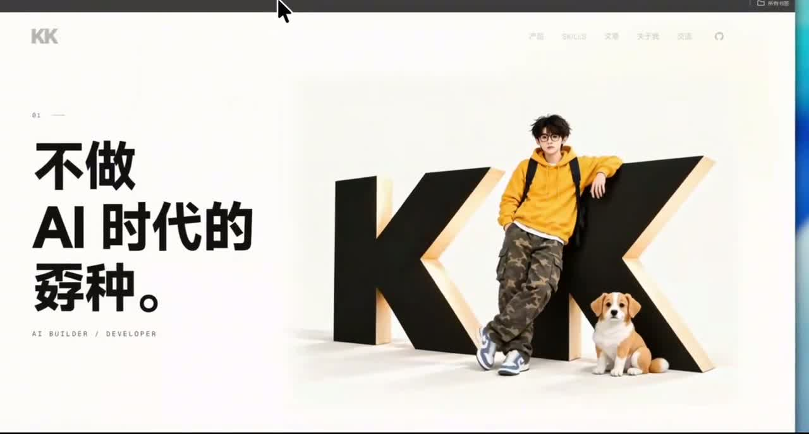
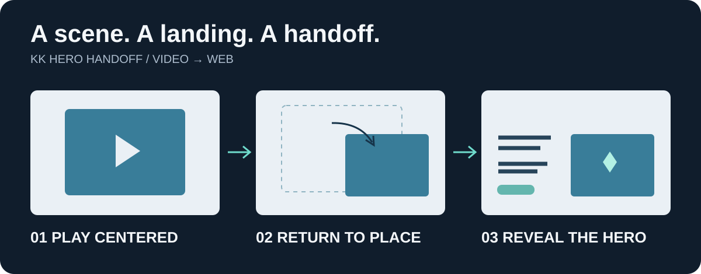

# kk-hero-handoff

**让入场视频自然回到网页，接上你的静态首屏。**

面向已有静态网站的 AI 编程 Skill：指导入场素材准备，让视频先在屏幕中央播放，在尾部回到主视觉位置，文字同步出现，最后交接给静态 Hero。

[开始使用](#开始使用) · [素材准备](references/material-preparation.md) · [接入参数](references/integration.md) · [报告问题](https://github.com/kkfor30/kk-hero-handoff/issues)

## 看实际效果

[](https://github.com/kkfor30/kk-hero-handoff/blob/main/assets/readme/demo.mp4)

**[▶ 观看完整 MP4 演示（约 8 秒）](https://github.com/kkfor30/kk-hero-handoff/blob/main/assets/readme/demo.mp4)** · [下载视频](https://raw.githubusercontent.com/kkfor30/kk-hero-handoff/main/assets/readme/demo.mp4)

这是作者网站的实际录屏，不是生成视频素材本身。展示的是居中播放 → 缩小回位 → 文字出现与静态首页接管；点击封面打开视频文件页观看。

<details>
<summary>展开查看：这三个步骤如何衔接</summary>



回位目标由你的页面布局决定，不局限于右侧。实际动作来自你提供的视频，视觉效果需要在自己的页面验收。

</details>

## 你负责想法，Agent 帮你落地

- **没有视频？** 从最终静态场景反推首尾帧要求，整理动作建议和可复制的视频提示词。
- **已经有视频？** 检查尺寸、选定接管帧，把居中、回位、文字出现和淡出接起来。
- **接上了却不自然？** 排查位置、时序、底图版本、色差与边缘，优先修正对应问题。
- **加载失败或不想看动画？** 恢复静态页面，支持跳过、重播、session 内只播一次和减弱动态设置。

视频生成 API **未内置**。使用你选择的工具生成视频，再交给 Agent 继续处理；图片生成也取决于当前 Agent 可用工具。

## 开始使用

### 1. 安装整个 Skill 文件夹

在 Codex 中，可以直接让 Agent 安装：

> 请从 https://github.com/kkfor30/kk-hero-handoff 安装这个 Skill。

也可以下载仓库 ZIP、解压，将包含 SKILL.md 的文件夹命名为 kk-hero-handoff，放入 Codex 用户 Skills 目录（用户主目录下的 .codex/skills）。不要只复制 SKILL.md：脚本、参考文档和模板需要一起保留。重新打开会话后调用。

其他支持本地 SKILL.md 的 Agent 可按其安装方式使用；未逐一验证兼容性。

### 2. 打开你的网站项目，发送这段话

```text
使用 $kk-hero-handoff，帮我的网站增加入场动画。
先检查当前首屏和素材，缺少什么请指导我准备。
希望视频先在屏幕中央播放，最后回到首页主视觉的位置，
文字同步出现，并平滑接上静态首屏。
```

建议准备：网站项目、满意的静态场景原图，以及已有视频（如果有）。整页截图可以说明布局，但不一定适合直接作为视频生成底图。

### 3. 跟着当前阶段继续

| 你有什么 | 接下来做什么 |
| --- | --- |
| 静态页面，没有视频 | 确认终态与动作 → 准备图片及提示词 → 在生成平台制作视频 |
| 静态页面和视频 | 检查真实尾部 → 选定接管图 → 接入网页 |
| 已有入场但衔接不佳 | 定位素材、位置或时序问题 → 针对性修复 |
| 还没有静态页面 | 先完成页面与最终构图，再开始接入 |

视频生成好后：

```text
视频在 assets/intro.mp4，最终静态场景是 assets/hero-rest.png。
动作已经满意，请检查接管画面并完成网页衔接。
保留当前页面布局和文案。
```

## 衔接为什么更容易调试

视频负责场景动作，网页负责居中、回位和文字显示。调整页面位置不必重新生成视频。

接管工具记录实际帧号、时间和视频哈希；替换视频后可检查是否误用旧记录。静态首页既可以使用视频实际帧，也可以保留高清原图，按差异选择处理方式。

[了解两种接管方案 →](references/handoff-frame.md)

## 环境与手动接入

使用媒体工具需要 **Python 3.11+、FFmpeg 和 FFprobe**，Python 脚本只使用标准库。运行自动化测试另需 **Node.js 22+**。浏览器模板使用 ES module，无前端框架依赖。

在 Skill 根目录运行，素材路径按实际项目填写：

```sh
python -X utf8 scripts/probe_intro.py hero-rest.png intro.mp4
python -X utf8 scripts/extract_tail.py intro.mp4 handoff.png
python -X utf8 scripts/validate_handoff.py --static hero-rest.png --video intro.mp4 --report handoff.json
```

抽帧默认选择最后一个实际视频帧，也支持 --frame 或 --at。输出已有文件时拒绝覆盖，便于保留版本。

把 [JS](templates/hero-intro.js) 和 [CSS](templates/hero-intro.css) 放入网站资源目录，使用 [接入示例](templates/integration.example.html) 适配页面；示例中的图片、视频和接管 JSON 需要自行提供。

```js
import { createHeroIntro } from './hero-intro.js';

const intro = createHeroIntro(document.querySelector('[data-hero-intro]'), {
  handoffTime: report.handoffTime // 从生成的接管 JSON 读取
});
intro.start();
// 组件卸载时调用 intro.destroy()
```

尺寸、文字时序、跳过、重播及框架接入说明见 [接入与参数](references/integration.md)。

## 当前边界

- 适合已有静态首屏，不会从零设计整个网站。
- 不包含生成平台密钥、私人素材或项目历史；README 仅附作者提供的公开演示录屏与封面，运行 Skill 不依赖它们。
- 通用模板使用独立视频层。复杂祖先蒙版、滤镜、旋转或裁剪布局需要针对性适配。
- 不能保证视频模型一次生成满意动作，也不能保证任意两张不同构图通过淡出就能接上。
- 自动化检查验证规格和运行逻辑；动作自然度、颜色与接缝仍需用户验收。

## 验证与贡献

```sh
node --test tests/runtime.test.mjs
python -X utf8 -B tests/test_media.py
```

测试覆盖时序、目标位置变化、媒体失败、跳过、资源清理及接管记录。媒体测试现场生成临时样本，无需作者的网站素材。

欢迎提交 Issue 或 PR。反馈时说明浏览器、页面结构、复现步骤和预期结果；如需分享素材，请使用可公开的最小示例。

## License

[MIT](LICENSE) · Copyright © 2026 [kkfor30](https://github.com/kkfor30)
